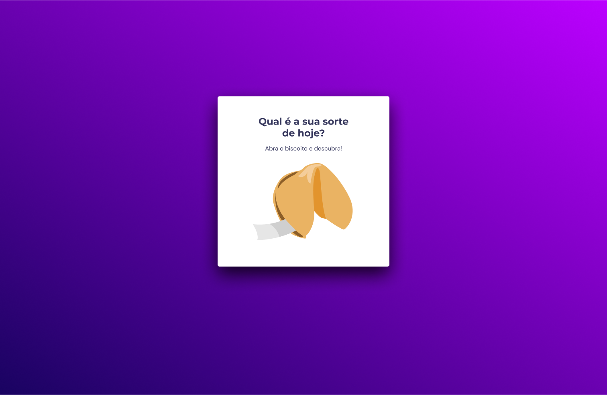

<h1 align="center"> Desafio Biscoito da Sorte 🥠</h1>

Neste desafio você deverá criar um jogo chamado Biscoito da Sorte, no qual o usuário, 
<strong>a partir de um clique ou enter**</strong>, abre um biscoito com a sua sorte do dia. 
Você aplicará o que aprendeu sobre vários temas, entre eles:
<ul>
  <li>Estrutura de dados HTML</li>
  <li>Animações com CSS</li>
  <li>Funções no Javascript</li>
  <li>Manipulação da DOM</li>
  <li>Biblioteca JS Math()</li>
  <li>Funções *callback*</li>
  <li>Arrays</li>
</ul>

  <a href="#-tecnologias">Tecnologias</a>&nbsp;&nbsp;&nbsp;|&nbsp;&nbsp;&nbsp;  
  <a href="#-layout">Layout</a>&nbsp;&nbsp;&nbsp;

 

  

  

## 🚀 Tecnologias

Esse projeto foi desenvolvido com as seguintes tecnologias:

- HTML e CSS
- JavaScript
- Git e Github
- Figma

## 🔖 Layout

 Aqui neste <a href="https://www.figma.com/community/file/1182751789348533739">Link</a> você tem acesso ao Figma do projeto.

Feito com ♥ by Rocketseat :wave: [Participe da nossa comunidade!](https://discord.gg/rocketseat)

